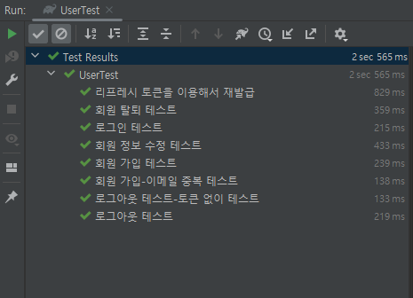

## 📁 회원 기능 Example

---

### [ 기술 스택]

```
Spring Boot
JPA
JWT + Spring Security
MySQL
```

### [설정]
```
1. MySQL DB 설정 필요
CREATE DATABASE springSecurity CHARACTER SET utf8 DEFAULT COLLATE utf8_general_ci;
username: jig123
password: root

2. 프로젝트 실행하면 초기계정으로 어드민 계정을 db에 추가하도록 함
email : admin@test.com
password : 1234
role : ADMIN
```

### [테스트]
```
- (회원 가입, 회원 정보 수정, 회원 탈퇴, 로그인, 로그아웃, 리프레시 토큰을 이용해서 재발급) 단위테스트
com.example.userexample.services.user.UserTest



-- 포스트맨을 통해서 각 기능 검증 완료
```

### [기능]
```
1. 유저 관리
 1) 회원 가입
    post /user
    
    param
        {
            "email" : "test2@test.com",
            "password" : "password2",
            "name" : "테스트2",
            "phoneNumber" : "010-1234-1234"
        }
        
    result
        회원가입 성공
        
    - 메일, 패스워드 필수값
    - 메일, 전화번호 형식 검사
    - 이메일 중복 불가
    
    
 2) 회원 정보 수정 : 로그인 된 내 정보 수정
    put /user/me
    
    header
        Authorization : Bearer 엑세스 토큰
    param
        {
            "password" : "password3",
            "name" : "테스트3",
            "phoneNumber" : "010-3333-3333"
        }
        
    result
        내 회원정보수정 성공
    
    - 전화번호 형식 검사
    - 헤더의 엑세스 토큰 정보가 유효하지 않으면 401
    - 헤더의 엑세스 토큰 정보에서 로그인 한 회원을 확인한 후 패스워드, 이름, 이메일 중 들어온 값을 DB에서 UPDATE
    
    
 3) 회원 탈퇴 : 로그인 된 내 정보 삭제
    delete /user/me
    
    header
        Authorization : Bearer 엑세스 토큰

    - 헤더의 엑세스 토큰 정보가 유효하지 않으면 401
    - 헤더의 엑세스 토큰 정보에서 로그인 한 회원을 확인한 후 DB에서 삭제


2. 유저 로그인 / 로그아웃 / 리프레시 토큰 재발급
 1) 로그인
    post /login
 
    param
        {
            "password" : "password3",
            "name" : "테스트3",
            "phoneNumber" : "010-3333-3333"
        }
    
    result
        로그인 성공
        header
            Authorization
            Authorization-refresh
    
    
 2) 로그아웃
    post /logout

    header
        Authorization : Bearer 엑세스 토큰
        
    result
        로그아웃 성공

    - 헤더의 엑세스 토큰 정보가 유효하지 않으면 500
    - 헤더의 엑세스 토큰 정보에서 로그인 한 회원을 확인한 후 DB에서 refreshToken 정보를 null로 update


 3) 리프레시 토큰을 이용해서 재발급
    post user/reissue
    
    header
        Authorization-refresh : Bearer 엑세스 토큰
        
    result
        토큰 재발급 성공
        
    - 리프레시 토큰을 검증해서 엑세스 토큰/리프레시 토큰 둘 다 재발급 해서 header에 담아준다.
```